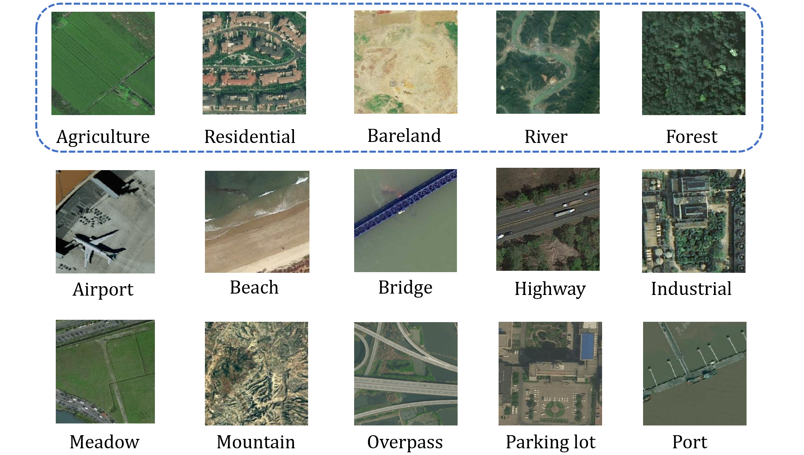

# FedRefiner

Official code for the paper "FedRefiner: Robust Federated Learning with Noisy Label Refinement for Remote Sensing".

## Installation

```bash
pip install -r requirements.txt
```

## Example Usage

```bash
python FL_train.py --alg fedrefiner --model resnet18 --dataset RS-5 --noise_rate 0.8 --noise_pattern symmetric
```
More settings can be found in `args.py`.


## Model Scalability


## Remote Sensing Imagery



## Citation

TBD.

## Acknowledgments
We sincerely appreciate the authors of the FedRS datasets, and more information can be found in the [FedRS](https://fedrs-bench.github.io/).